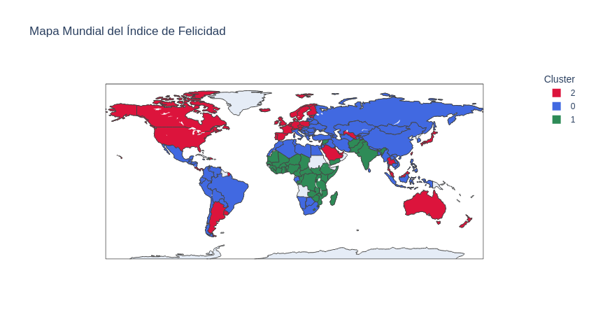
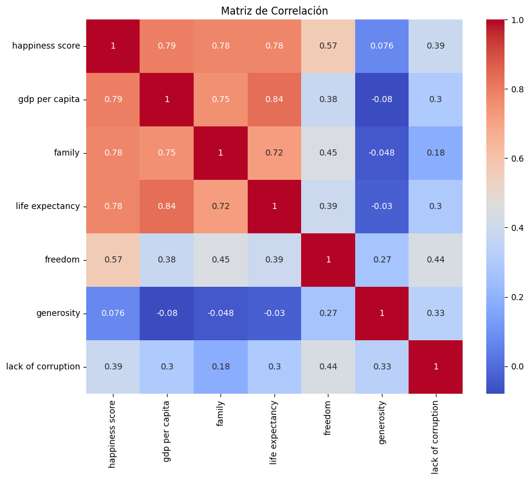

# Proyecto de Machine Learning: Análisis y Predicción de la Felicidad Mundial

<a target="_blank" href="https://cookiecutter-data-science.drivendata.org/">
    
</a>


## Problema ML

**Tipo de problema:** Aprendizaje supervisado (regresión) y no supervisado (clustering).

**Objetivo:**

- Predicción: Estimar el nivel de felicidad (`Score`) de un país usando variables socioeconómicas.
- Agrupación: Identificar grupos de países similares según sus características de bienestar (K-Means).

## Diagrama de flujo

```text
[Ingreso del dataset]
        |
        v
[Exploración y limpieza de datos]
        |
        v
[Análisis de correlación]
        |
        v
[Modelo de Regresión Lineal] ----> [Evaluación: R², MSE]
        |
        v
[Modelo de Clustering (K-Means)] ----> [Visualización con PCA y mapa mundial]
        |
        v
[Análisis de Resultados y Conclusiones]
```

## Descripción del Dataset y Diccionario de Datos

**Fuente:** World Happiness Report

**Total de registros:** 156 países

**Columnas principales:**

| Columna                      | Tipo   | Descripción                                         |
| ---------------------------- | ------ | --------------------------------------------------- |
| Overall rank                 | Entero | Ranking general de felicidad del país.              |
| Country or region            | Texto  | Nombre del país.                                    |
| Score                        | Float  | Nivel de felicidad (variable objetivo).             |
| GDP per capita               | Float  | Ingreso per cápita normalizado.                     |
| Social support               | Float  | Nivel de apoyo social percibido.                    |
| Healthy life expectancy      | Float  | Esperanza de vida saludable.                        |
| Freedom to make life choices | Float  | Libertad para tomar decisiones personales.          |
| Generosity                   | Float  | Generosidad de la población.                        |
| Perceptions of corruption    | Float  | Percepción de corrupción en el gobierno y sociedad. |

## Model Card

**Model Name:** World Happiness Regressor 2019

**Model Type:** Linear Regression

**Developed by:** Edynson Coronado Icochea

**Training Data:** Subconjunto de 80% del dataset con variables seleccionadas.

**Intended Use:** Predicción del nivel de felicidad de un país según factores socioeconómicos.

**Limitations:**

- No contempla factores culturales, políticos o históricos.
- Supone relaciones lineales entre variables.

**Ethical Considerations:**

- Evitar el uso para justificar decisiones políticas sin contextualización.
- No reemplaza el estudio multidimensional del bienestar.

**Metrics:** R² score, MSE

## Resultados

### Modelo de Regresión:

- **Variables usadas:** GDP per capita, Social support, Healthy life expectancy, Freedom, Perceptions of corruption
- **R² Score:** 0.596
- **MSE:** 0.420

**Importancia de las variables:**

1. Freedom: coef. 1.886
2. Social support: coef. 1.121
3. Healthy life expectancy: coef. 1.012
4. GDP per capita: coef. 0.795

### Clustering (K-Means):

- **Variables:** Las 6 características socioeconómicas
- **k=3 clusters:** agrupación de países según perfiles de bienestar
- **Visualizaciones:** PCA 2D, mapa mundial coloreado por cluster


## Conclusiones

- Las variables con mayor influencia en la felicidad son la libertad para tomar decisiones y el apoyo social.
- El modelo de regresión explica cerca del 60% de la variabilidad en el score.
- El clustering reveló grupos diferenciados de países con patrones similares de bienestar, útiles para políticas comparativas.
- Se recomienda expandir el modelo con datos de otros años y nuevas variables (educación, medio ambiente, etc.).



## Autor

Edynson Coronado Icochea 
[LinkedIn](https://www.linkedin.com/in/edynson-coronado-icochea/)

## Licencia

MIT License